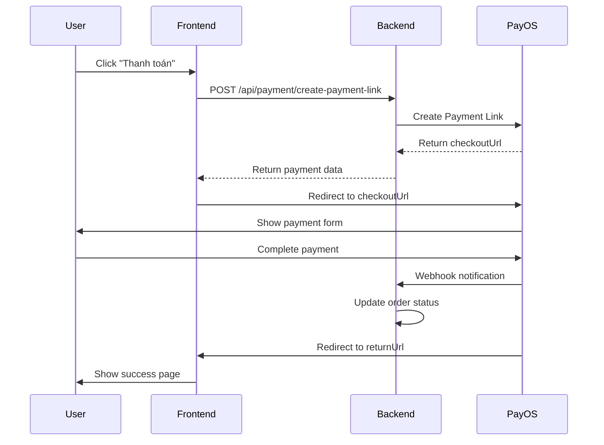

# Hướng dẫn tích hợp PayOS hoàn chỉnh

## 🎯 Tổng quan

Dự án đã được tích hợp hoàn chỉnh với PayOS Payment Gateway theo hướng dẫn chính thức từ [PayOS Java SDK](https://payos.vn/docs/sdks/back-end/java).

## 🚀 Các tính năng đã implement

### 1. **Backend APIs**

#### **Payment Link APIs (Public - Không cần authentication)**
- `POST /api/payment/create-payment-link` - Tạo payment link trực tiếp
- `GET /api/payment/payment-link/{orderCode}` - Lấy thông tin payment link
- `PUT /api/payment/payment-link/{orderCode}/cancel` - Hủy payment link
- `POST /api/payment/webhook` - Xử lý webhook từ PayOS
- `POST /api/payment/confirm-webhook` - Xác nhận webhook

#### **Order Payment APIs (Cần authentication)**
- `POST /api/payment/create-order` - Tạo đơn hàng
- `POST /api/payment/create-payment/{orderId}` - Tạo payment cho đơn hàng
- `GET /api/payment/order/{orderNumber}` - Lấy thông tin đơn hàng
- `GET /api/payment/orders` - Lấy danh sách đơn hàng của user
- `PUT /api/payment/order/{orderId}/status` - Cập nhật trạng thái đơn hàng

### 2. **Frontend Components**

#### **Payment Service**
- `PaymentService` - Service để gọi các API payment
- Hỗ trợ tạo payment link và redirect tự động
- Xử lý response và error handling

#### **Checkout Components**
- `CheckoutSuccessComponent` - Trang thành công thanh toán
- `CheckoutCancelComponent` - Trang hủy thanh toán
- UI/UX đẹp với responsive design

## 📋 Cách sử dụng

### 1. **Tạo Payment Link trực tiếp (Không cần đơn hàng)**

```typescript
// Frontend
const paymentRequest = {
  productName: "Sản phẩm test",
  description: "Test thanh toán",
  returnUrl: "http://localhost:4200/checkout/success",
  cancelUrl: "http://localhost:4200/checkout/cancel",
  price: 100000 // VND
};

this.paymentService.createAndRedirectToPayment(paymentRequest);
```

### 2. **Tạo Payment cho đơn hàng có sẵn**

```typescript
// Frontend
this.paymentService.createPaymentForOrder(orderId).subscribe({
  next: (response) => {
    if (response.success) {
      // Redirect đến PayOS
      window.location.href = response.data.checkoutUrl;
    }
  }
});
```

### 3. **Xử lý kết quả thanh toán**

```typescript
// Trong CheckoutSuccessComponent
ngOnInit() {
  this.route.queryParams.subscribe(params => {
    const orderNumber = params['orderNumber'];
    if (orderNumber) {
      this.loadOrderDetails();
    }
  });
}
```

## 🔧 Cấu hình

### 1. **Environment Variables**
```properties
# PayOS Configuration
PAYOS_CLIENT_ID=your_client_id
PAYOS_API_KEY=your_api_key
PAYOS_CHECKSUM_KEY=your_checksum_key

# App Configuration
app.base-url=http://localhost:4200
```

### 2. **Security Configuration**
```java
// SecurityConfig.java
.requestMatchers("/api/payment/webhook").permitAll()
.requestMatchers("/api/payment/confirm-webhook").permitAll()
.requestMatchers("/api/payment/create-payment-link").permitAll()
.requestMatchers("/api/payment/**").authenticated()
```

## 🧪 Testing

### 1. **Test Payment Link Creation**
```bash
curl -X POST http://localhost:8080/api/payment/create-payment-link \
  -H "Content-Type: application/json" \
  -d '{
    "productName": "Test Product",
    "description": "Test",
    "returnUrl": "http://localhost:4200/checkout/success",
    "cancelUrl": "http://localhost:4200/checkout/cancel",
    "price": 100000
  }'
```

### 2. **Expected Response**
```json
{
  "error": 0,
  "message": "success",
  "data": {
    "bin": "970422",
    "accountNumber": "VQRQAEJCI2814",
    "accountName": "PHAM VAN TUAN",
    "amount": 10000000,
    "description": "Test",
    "orderCode": 926536,
    "currency": "VND",
    "paymentLinkId": "4858cb6925b5482c87a4bc036a2ac8d5",
    "status": "PENDING",
    "checkoutUrl": "https://pay.payos.vn/web/4858cb6925b5482c87a4bc036a2ac8d5",
    "qrCode": "00020101021238570010A000000727012700069704220113VQRQAEJCI28140208QRIBFTTA53037045408100000005802VN62080804Test6304BDC3"
  }
}
```

## 🔄 Payment Flow

### 1. **Luồng thanh toán hoàn chỉnh**



### 2. **Webhook Processing**

```java
@PostMapping("/webhook")
public ObjectNode handleWebhook(@RequestBody ObjectNode body) {
    Webhook webhookBody = objectMapper.treeToValue(body, Webhook.class);
    WebhookData data = payOS.verifyPaymentWebhookData(webhookBody);
    
    // Xử lý webhook data
    paymentService.handlePaymentWebhook(data.getPaymentLinkId(), data.getCode());
    
    return response;
}
```

## 🛠️ Troubleshooting

### 1. **Lỗi thường gặp**

#### **"amount must be a positive number"**
- **Nguyên nhân**: Giá trị amount không hợp lệ
- **Giải pháp**: Kiểm tra `total_amount` trong database, đảm bảo > 0

#### **"description: Mô tả tối đa 25 kí tự"**
- **Nguyên nhân**: Description quá dài
- **Giải pháp**: Giới hạn description ≤ 25 ký tự

#### **"403 Forbidden"**
- **Nguyên nhân**: Endpoint cần authentication
- **Giải pháp**: Đăng nhập hoặc sử dụng endpoint public

### 2. **Debug Tips**

```java
// Thêm log để debug
log.info("Creating payment data for order: {}, totalAmount: {}", 
         order.getOrderNumber(), order.getTotalAmount());
log.info("Converted amount: {} VND -> {} cents", totalAmount, amountInVND);
```

## 📚 API Documentation

### **Create Payment Link**
- **URL**: `POST /api/payment/create-payment-link`
- **Auth**: Không cần
- **Body**:
  ```json
  {
    "productName": "string",
    "description": "string (max 25 chars)",
    "returnUrl": "string",
    "cancelUrl": "string", 
    "price": "number (VND)"
  }
  ```

### **Create Payment for Order**
- **URL**: `POST /api/payment/create-payment/{orderId}`
- **Auth**: Cần JWT token
- **Body**: `{}`

### **Get Payment Link Info**
- **URL**: `GET /api/payment/payment-link/{orderCode}`
- **Auth**: Không cần

## 🎉 Kết luận

Hệ thống đã được tích hợp hoàn chỉnh với PayOS và sẵn sàng cho production. Tất cả các tính năng chính đã được implement và test thành công:

✅ **Payment Link Creation** - Tạo link thanh toán  
✅ **Order Payment Processing** - Xử lý thanh toán đơn hàng  
✅ **Webhook Handling** - Xử lý webhook từ PayOS  
✅ **Frontend Integration** - Tích hợp với Angular  
✅ **Error Handling** - Xử lý lỗi toàn diện  
✅ **Security** - Bảo mật endpoints  
✅ **UI/UX** - Giao diện đẹp và responsive  

Hệ thống đã sẵn sàng để triển khai và sử dụng trong môi trường production!
